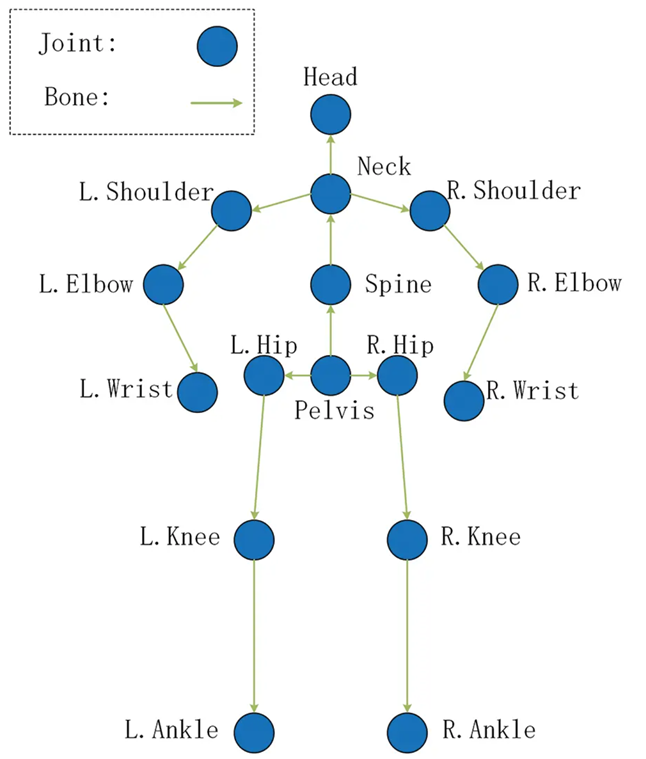

# Pose World Model
This project implements a latent world model that learns the dynamics of human motion from pose sequences.

A Transformer-based architecture is used to model temporal dependencies and predict future human trajectories in latent space through autoregressive rollouts.

The goal is to learn a compact, predictive representation of human dynamics that can be reused for downstream tasks such as interaction modeling and planning.

- A MLP learns a latent representation of pose 
- A Transformer models temporal dynamics in latent space
- Future poses are generated by rolling forward the learned representation

# Dataset

We use a 17-joint subset of Human3.6M following common practice to remove redundant joints and focus on core human kinematics.

# Evaluation

- Predicted vs. True Motion

- Training Curve

- Metrics: MPJPE (Mean per Joint Position Error)

# References

Dataset
- Catalin Ionescu, Dragos Papava, Vlad Olaru and Cristian Sminchisescu, Human3.6M: Large Scale Datasets and Predictive Methods for 3D Human Sensing in Natural Environments, IEEE Transactions on Pattern Analysis and Machine Intelligence, vol. 36, No. 7, July 2014 [pdf][bibtex]

- Catalin Ionescu, Fuxin Li and Cristian Sminchisescu, Latent Structured Models for Human Pose Estimation, International Conference on Computer Vision, 2011 [pdf][bibtex]

Figures
- 3D Human Pose Estimation Using Two-Stream Architecture with Joint Training. (2023). Computer Modeling in Engineering & Sciences, 137(1), 607–629. doi:10.32604/cmes.2023.024420